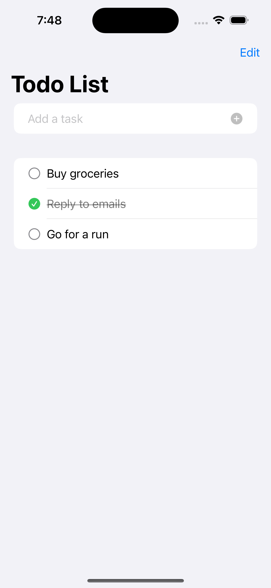

# Todo List

After 4+ years building apps in React Native and Flutter, time to go native. This is app 2 of 10.

## Goal

Move past static layout into real state and persistence: CRUD on a list, `@Observable` for the data layer, `List` with swipe actions, and `Codable` + `UserDefaults` to survive app restarts.

## What it does

A todo list with add, complete-toggle, delete, and persistence across app launches via UserDefaults.

## Screenshots

  

## What I learned

- `@Observable` (the newer macro, not `ObservableObject` + `@Published`) is a lot less boilerplate than I expected. No property wrappers on every field, SwiftUI just tracks what a view actually reads.
- `Codable` synthesizing encode/decode for free is genuinely nice. No manual `toJson`/`fromJson` like I'd write in Dart, no serializer setup like RN would need.
- `List` + `.onDelete` gives you swipe-to-delete essentially for free, which would take actual gesture handling to replicate in RN.
- UserDefaults is fine for this scale but I can already tell it won't hold up once an app needs querying/relationships. Good excuse to move to SwiftData in app 3.

## What I'd do differently

<!-- fill in after building -->

## License

MIT, see [LICENSE](LICENSE).

---

Built by [Rishav Jha](https://rishavjha.com)
